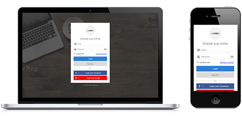
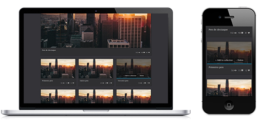
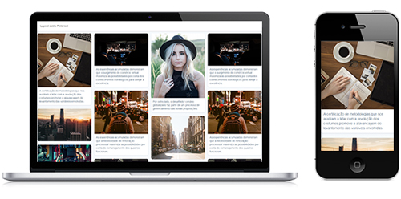
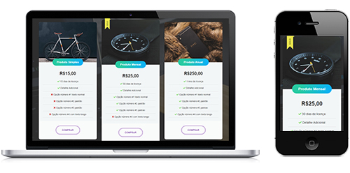

## Painel de Login, sem site foco **(Responsivo)**
:computer: CSS + HTML5 + jQuery (sem framework) 
:link: para ver funcionando, [clique aqui](https://codepen.io/jimmyfilips/pen/BrgEXK) 
:page_facing_up: Código: 
[HTML](examples/login/index.html) -
[CSS](examples/login/css/custom.css) -
[JS](examples/login/js/script.js) 

  
## Pens, [site foco](https://codepen.io/jimmyfilips/) **(Responsivo)**
:computer: CSS + HTML5 + Flexbox (sem framework) 
:link: para ver funcionando, [clique aqui](https://codepen.io/jimmyfilips/pen/OvKPMG) 
:page_facing_up: Código: 
[HTML](examples/codepen/index.html) -
[CSS](examples/codepen/css/custom.css) 

  
## Pinterest Layout, [site foco](https://br.pinterest.com/) **(Responsivo)**
:computer: CSS + HTML5 (sem framework) 
:link: para ver funcionando, [clique aqui](https://codepen.io/jimmyfilips/pen/RMNGRw) 
:page_facing_up: Código: 
[HTML](examples/pinterest/index.html) -
[CSS](examples/pinterest/css/custom.css) 

  
## Tabela de Produtos, sem site foco **(Responsivo)**
:computer: CSS + HTML5 + Bootstrap 
:link: para ver funcionando, [clique aqui](https://codepen.io/jimmyfilips/pen/odgrpr) 
:page_facing_up: Código: 
[HTML](examples/produtos/index.html) -
[CSS](examples/produtos/css/custom.css) 
